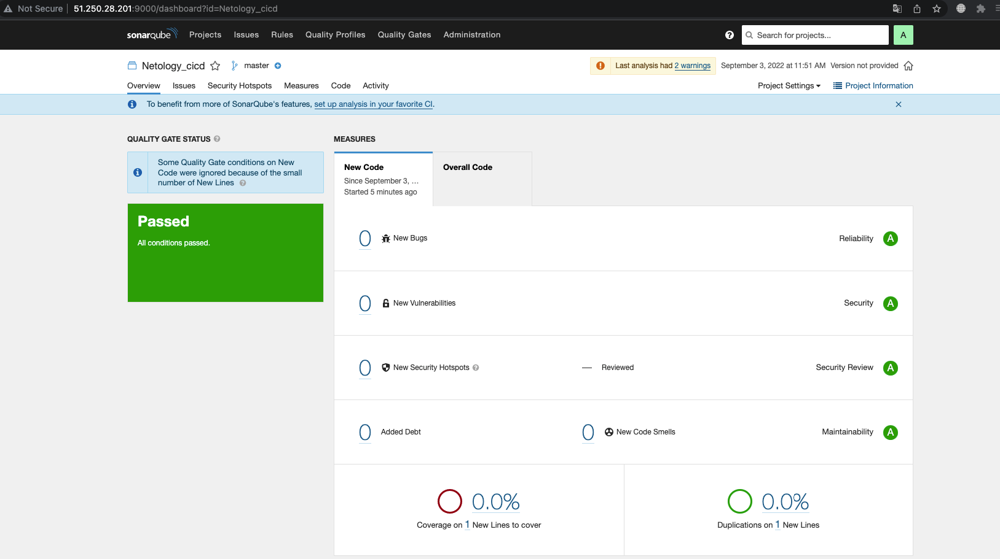

# Домашная работа к занятию "09.03 CI\CD"

[Домашнее задание](https://github.com/netology-code/mnt-homeworks/tree/MNT-13/09-ci-03-cicd) 

## Знакомство с SonarQube
- Делаем скриншот успешного прохождения анализа, прикладываем к решению ДЗ



---
## Знакомство с Nexus
- В ответе присылаем файл `maven-metadata.xml` для этого артефекта.

Содержимое файла:
```
<metadata modelVersion="1.1.0">
<groupId>netology</groupId>
<artifactId>java</artifactId>
<versioning>
<latest>8_282</latest>
<release>8_282</release>
<versions>
<version>8_102</version>
<version>8_282</version>
</versions>
<lastUpdated>20220903092804</lastUpdated>
</versioning>
</metadata>
```

---
## Знакомство с Maven
- В ответе присылаем исправленный файл `pom.xml`

Содержимое файла:
```
<project xmlns="http://maven.apache.org/POM/4.0.0" xmlns:xsi="http://www.w3.org/2001/XMLSchema-instance"
  xsi:schemaLocation="http://maven.apache.org/POM/4.0.0 http://maven.apache.org/xsd/maven-4.0.0.xsd">
  <modelVersion>4.0.0</modelVersion>
 
  <groupId>com.netology.app</groupId>
  <artifactId>simple-app</artifactId>
  <version>1.0-SNAPSHOT</version>
   <repositories>
    <repository>
      <id>my-repo</id>
      <name>maven-public</name>
      <url>http://158.160.3.110:8081/repository/maven-releases/</url>
    </repository>
  </repositories>
  <dependencies>
    <dependency>
      <groupId>netology</groupId>
      <artifactId>java</artifactId>
      <version>8_282</version>
      <classifier>distrib</classifier>
      <type>tar.gz</type>
    </dependency>
  </dependencies>
</project>
```

