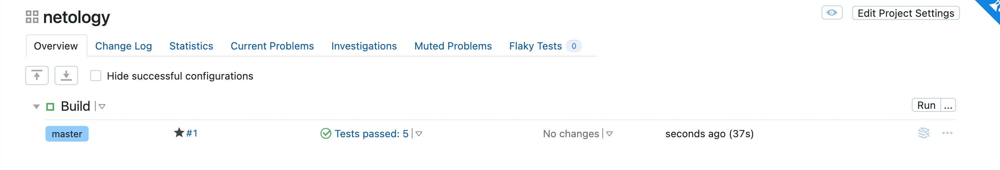

# Домашная работа к занятию "09.05 Teamcity"

[Домашнее задание](https://github.com/netology-code/mnt-homeworks/tree/MNT-13/09-ci-05-teamcity)

## Подготовка к выполнению

В ya.cloud были созданы три инстанса согласно заданию и развернут Nexus с помощью [playbook](https://github.com/netology-code/mnt-homeworks/blob/MNT-13/09-ci-05-teamcity/infrastructure)

## Основная часть

1. Создан проект `netology` и добавлен ключ ssh для доступа к репозиторию
2 и 3.  Выполнил autodetect конфигурации, сохарнил шаги и запустил первую сборку

4. Добавил два шага: если сборка по ветке `master`, то должен происходит `mvn clean deploy`, иначе `mvn clean test`.

5. Загрузил файл [settings.xml](https://github.com/netology-code/mnt-homeworks/blob/MNT-13/09-ci-05-teamcity/teamcity/settings.xml) и добавил в настройки build. 
6. Актуализировал ссылки на репозторий и nexus в файле pom.xml.
7. Запустил сборку по master.


8. Мигрировал `build configuration` в репозиторий.
9. Создал отдельную ветку `feature/add_reply` в репозитории.
10. Написал новый метод для класса Welcomer, который долен возвращать произвольную реплику, содержащую слово `hunter`.
```
public String sayHunter(){
		return "The deer hunter, USA";
	}
```
11. Дополнил тест для нового метода на поиск слова `hunter` в новой реплике.
```
	@Test
	public void welcomerSaysHunter() {
		assertThat(welcomer.sayWelcome(), containsString("hunter"));
		assertThat(welcomer.sayFarewell(), containsString("hunter"));
		assertThat(welcomer.sayHunter(), containsString("hunter"));
	}
```
12. Произвел push всех изменений в новую ветку в репозиторий.
13. сборка самостоятельно запустилась, тесты прошли успешно.

14. Внес изменения из ветки `feature\add_reply` в `master` через `merge`.
15. Собранный артефакт отвуствует в сборке по ветке `master`,
в логах присутствует ошибка `Repository does not allow updating assets: maven-releases` с кодом 400.

16. Настроил конфигурацию так, чтобы она собирала '.jar' в артефакты сборки.

17. Выолнил сборку после внесения последних изменений, сборка прошла успешно.
18. Конфигурации проверил. 
19. Ссылка на [репозиторий](https://github.com/everoff/example-teamcity)


  
