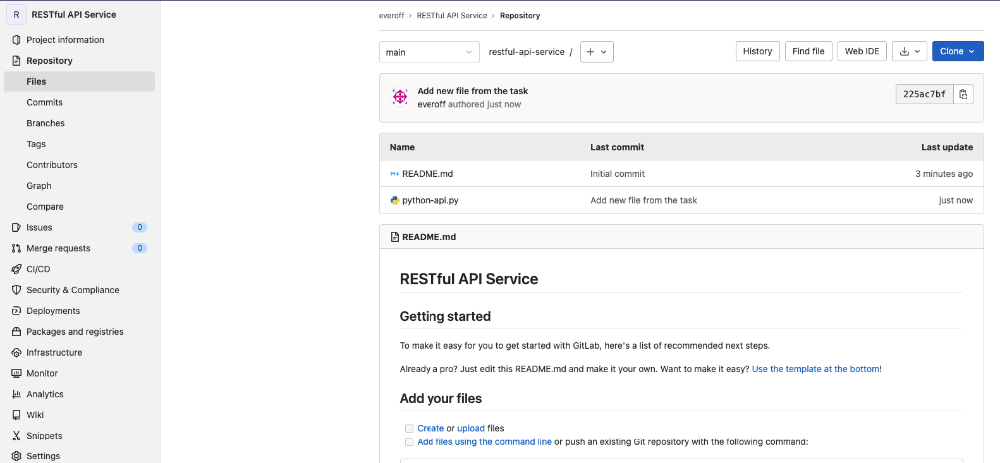
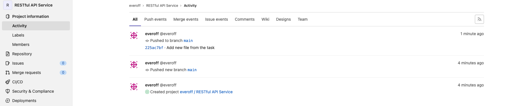
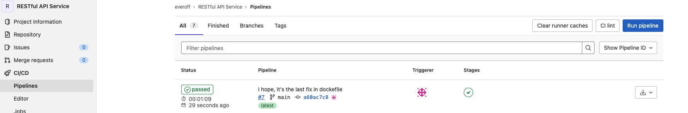
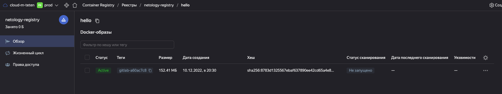
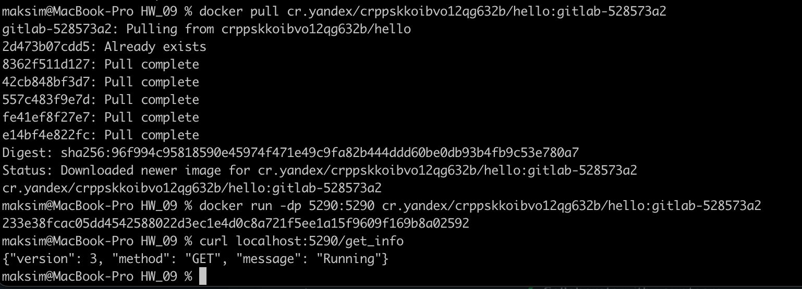

# Домашнаая работа к занятию "09.06 Gitlab"

[Домашнее задание](https://github.com/netology-code/mnt-homeworks/blob/MNT-13/09-ci-06-gitlab/README.md)

## Подготовка к выполнению

1. Подготовил gitlab и кластер kubernetes согласно приведенной инструкции.

## Основаня часть

### DevOps

В репозитории содержится код проекта на python. Проект - RESTful API сервис. Ваша задача автоматизировать сборку образа с выполнением python-скрипта:
1. Образ собирается на основе [centos:7](https://hub.docker.com/_/centos?tab=tags&page=1&ordering=last_updated)
2. Python версии не ниже 3.7
3. Установлены зависимости: `flask` `flask-restful`
4. Создана директория `/python_api`
5. Скрипт из репозитория размещён в /python_api
6. Точка вызова: запуск скрипта
7. Если сборка происходит на ветке `master`: должен подняться pod kubernetes на основе образа `python-api`, иначе этот шаг нужно пропустить

**Решение**

Создал и настроил проект с pipeline. Сборка прошла успешно, docker-образ появился в репозитории.

[Репозиторий](https://console.cloud.yandex.ru/folders/b1gaib5iqasmdmvv22rl/container-registry/registries/crppskkoibvo12qg632b/overview/hello/image)

ps обожаю опечатки, когда смотришь и ищешь серьезные ошибки, а оказывается простая опечатка.

### Produect Owner

Вашему проекту нужна бизнесовая доработка: необходимо поменять JSON ответа на вызов метода GET `/rest/api/get_info`, необходимо создать Issue в котором указать:
1. Какой метод необходимо исправить
2. Текст с `{ "message": "Already started" }` на `{ "message": "Running"}`
3. Issue поставить label: feature

**Решение**

Создал [Issue](https://netology-git.gitlab.yandexcloud.net/everoff/restful-api-service/-/issues/1)

### Developer

Вам пришел новый Issue на доработку, вам необходимо:
1. Создать отдельную ветку, связанную с этим issue
2. Внести изменения по тексту из задания
3. Подготовить Merge Requst, влить необходимые изменения в `master`, проверить, что сборка прошла успешно

**Решение**

Выполнил доработку кода, [Merge request](https://netology-git.gitlab.yandexcloud.net/everoff/restful-api-service/-/merge_requests/1)

### Tester

Разработчики выполнили новый Issue, необходимо проверить валидность изменений:
1. Поднять докер-контейнер с образом `python-api:latest` и проверить возврат метода на корректность
2. Закрыть Issue с комментарием об успешности прохождения, указав желаемый результат и фактически достигнутый

**Решение**

Понял докер-контейнер с последним образом и проверил возврат метода после внесения изменений на корректность.

