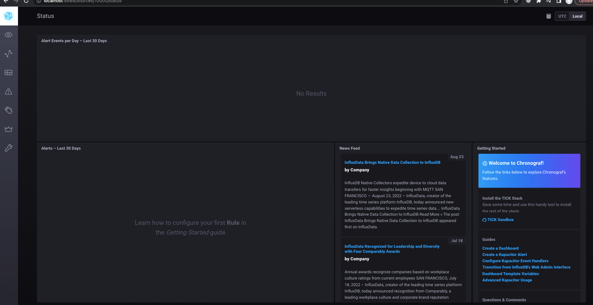

# Домашная работа к занятию "10.02. Системы мониторинга"

[Домашнее задание](https://github.com/netology-code/mnt-homeworks/tree/MNT-13/10-monitoring-02-systems)

## Обязательная часть
1.
**Push-модель**

Достоинаства:
* Можно использовать динамическую инфраструктуру, в pull-модели нет такой возможности
* UDP является менее затратным способом передачи данных, но в то же время имеет недостаток.

Недостатки:
* В связи с передачей данных по протоколу UDP, есть вероятность потери части пакетов

**Pull-модель**

Достоинства:
* В отличии от push-модели, здесь агент уже прописаны, что позволяет контролировать подлинность данных, сторонние агенты не смогут передать данные в систему мониторинга
* Безопасность (единый proxy-server до всех агентов с TLS)

Недостатки:
* Отсутствует возможность использовать линамическую инфраструктуру или придется каждый раз править конфигурацию

2.
- Prometheus - pull
- TICK - push
- Zabbix - push + pull
- VictoriaMetrics - push + pull
- Nagios - pull

3. Склонировал [репозиторий](https://github.com/influxdata/sandbox/tree/master) и запустил TICK-стэк, используя технологии docker и docker-compose.

Вывод `curl http://localhost:8086/ping -v`
 ```
maksim@MacBook-Pro sandbox % curl http://localhost:8086/ping -v
*   Trying ::1...
* TCP_NODELAY set
* Connected to localhost (::1) port 8086 (#0)
> GET /ping HTTP/1.1
> Host: localhost:8086
> User-Agent: curl/7.64.1
> Accept: */*
>
< HTTP/1.1 204 No Content
< Content-Type: application/json
< Request-Id: bcd2f2bd-3bd8-11ed-8139-0242ac120003
< X-Influxdb-Build: OSS
< X-Influxdb-Version: 1.8.10
< X-Request-Id: bcd2f2bd-3bd8-11ed-8139-0242ac120003
< Date: Sat, 24 Sep 2022 07:15:58 GMT
<
* Connection #0 to host localhost left intact
* Closing connection 0
```

Вывод `curl http://localhost:8888`
```
maksim@MacBook-Pro sandbox % curl http://localhost:8888
<!DOCTYPE html><html><head><link rel="stylesheet" href="/index.c708214f.css"><meta http-equiv="Content-type" content="text/html; charset=utf-8"><title>Chronograf</title><link rel="icon shortcut" href="/favicon.70d63073.ico"></head><body> <div id="react-root" data-basepath=""></div> <script type="module" src="/index.e81b88ee.js"></script><script src="/index.a6955a67.js" nomodule="" defer></script> </body></html>%
```

Вывод `curl http://localhost:9092/kapacitor/v1/ping`
```

```

4. Добавил в конфигурацию telegraf плагины `disc` `mem`.


5. Добавил в конфигурацию telegraf плагин `docker`.


