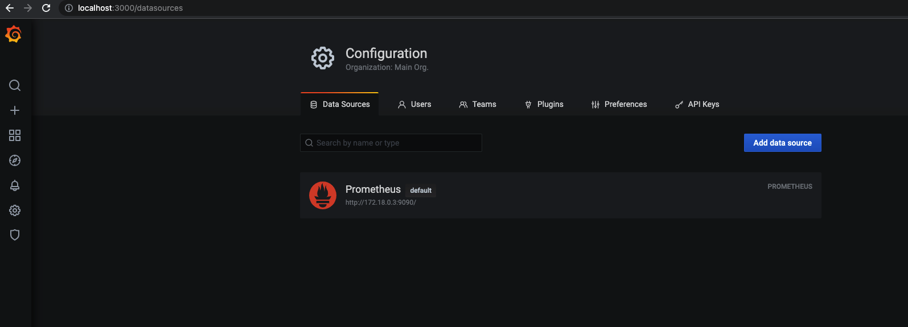
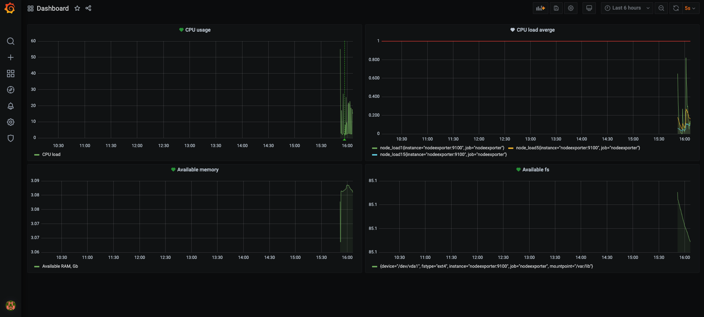

# Домашняя работа к занятию "10.03. Grafana"

[Домашнее задание](https://github.com/netology-code/mnt-homeworks/tree/master/10-monitoring-03-grafana)

## Обязательная часть

1. Запустил связку prometheus-grafana с использованием docker-compose.

2. Добавил panels в Dashboard
- Утилизация CPU для nodeexporter (в процентах, 100-idle)

`100 -(avg by (instance) (rate(node_cpu_seconds_total{job="nodeexporter",mode="idle"}[1m])) * 100)`
- CPULA 1/5/15

`node_load1{instance="nodeexporter:9100", job="nodeexporter"}
node_load5{instance="nodeexporter:9100", job="nodeexporter"}
node_load15{instance="nodeexporter:9100", job="nodeexporter"}`
- Количество свободной оперативной памяти

`node_memory_MemAvailable_bytes /1048576000`
- Количество места на файловой системе

`node_filesystem_avail_bytes{fstype!='tmpfs'} / node_filesystem_size_bytes * 100`

3. Добавил alerts

4. Сохранил Dashboard
[json](https://github.com/everoff/devops-netology/blob/main/Homeworks/HW_monitoring_03_grafana/dashboard.json)
