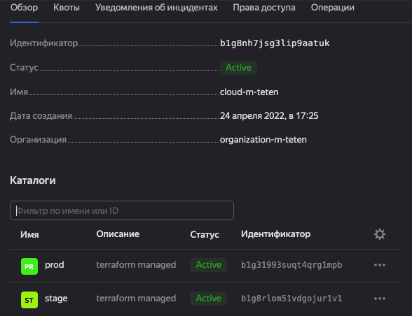
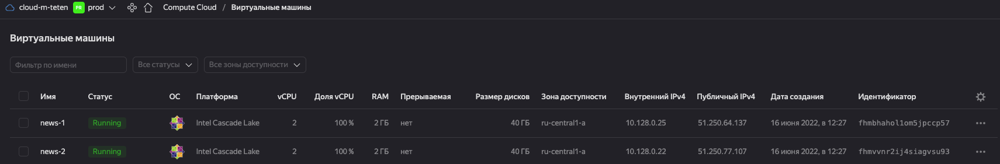
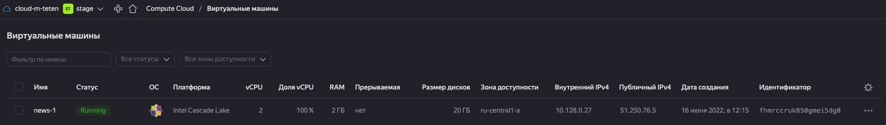

# Домашняя работа к занятию "7.2. Облачные провайдеры и синтаксис Terraform."

ВМ разворачивал по примеру лекции, конфиги брал из  [репозиотрия](https://gitlab.com/k11s-os/infrastructure-as-code).
Мой репозиторий [Terraform](https://github.com/everoff/devops-netology/tree/main/terraform) 

- Вывод `Terraform init`
```
maksim@MacBook-Pro demo % terraform init
Initializing modules...
- news in ../modules/instance
Downloading registry.terraform.io/hamnsk/vpc/yandex 0.5.0 for vpc...
- vpc in .terraform/modules/vpc

Initializing the backend...

Initializing provider plugins...
- Finding yandex-cloud/yandex versions matching "0.61.0, ~> 0.61.0"...
- Installing yandex-cloud/yandex v0.61.0...
- Installed yandex-cloud/yandex v0.61.0 (self-signed, key ID E40F590B50BB8E40)

Partner and community providers are signed by their developers.
If you'd like to know more about provider signing, you can read about it here:
https://www.terraform.io/docs/cli/plugins/signing.html

Terraform has created a lock file .terraform.lock.hcl to record the provider
selections it made above. Include this file in your version control repository
so that Terraform can guarantee to make the same selections by default when
you run "terraform init" in the future.

Terraform has been successfully initialized!

You may now begin working with Terraform. Try running "terraform plan" to see
any changes that are required for your infrastructure. All Terraform commands
should now work.

If you ever set or change modules or backend configuration for Terraform,
rerun this command to reinitialize your working directory. If you forget, other
commands will detect it and remind you to do so if necessary.
```

- Вывод `Terrarom plan`
```
maksim@MacBook-Pro demo % terraform plan
module.vpc.data.yandex_compute_image.nat_instance: Reading...
module.vpc.data.yandex_compute_image.nat_instance: Read complete after 1s [id=fd8uj8cu5v8u8kfnosb4]

Terraform used the selected providers to generate the following execution plan. Resource actions are indicated with the following symbols:
  + create
 <= read (data resources)

Terraform will perform the following actions:

  # module.news.data.yandex_compute_image.image will be read during apply
  # (depends on a resource or a module with changes pending)
 <= data "yandex_compute_image" "image" {
      + created_at    = (known after apply)
      + description   = (known after apply)
      + family        = "centos-7"
      + folder_id     = (known after apply)
      + id            = (known after apply)
      + image_id      = (known after apply)
      + labels        = (known after apply)
      + min_disk_size = (known after apply)
      + name          = (known after apply)
      + os_type       = (known after apply)
      + product_ids   = (known after apply)
      + size          = (known after apply)
      + status        = (known after apply)
    }

  # module.news.yandex_compute_instance.instance[0] will be created
  + resource "yandex_compute_instance" "instance" {
      + created_at                = (known after apply)
      + description               = "News App Demo"
      + folder_id                 = (known after apply)
      + fqdn                      = (known after apply)
      + hostname                  = "news-1"
      + id                        = (known after apply)
      + metadata                  = {
          + "ssh-keys" = <<-EOT
                centos:ssh-rsa 
            EOT
        }
      + name                      = "news-1"
      + network_acceleration_type = "standard"
      + platform_id               = "standard-v2"
      + service_account_id        = (known after apply)
      + status                    = (known after apply)
      + zone                      = "ru-central1-a"

      + boot_disk {
          + auto_delete = true
          + device_name = (known after apply)
          + disk_id     = (known after apply)
          + mode        = (known after apply)

          + initialize_params {
              + description = (known after apply)
              + image_id    = (known after apply)
              + name        = (known after apply)
              + size        = 40
              + snapshot_id = (known after apply)
              + type        = "network-ssd"
            }
        }

      + network_interface {
          + index              = (known after apply)
          + ip_address         = (known after apply)
          + ipv4               = true
          + ipv6               = (known after apply)
          + ipv6_address       = (known after apply)
          + mac_address        = (known after apply)
          + nat                = true
          + nat_ip_address     = (known after apply)
          + nat_ip_version     = (known after apply)
          + security_group_ids = (known after apply)
          + subnet_id          = (known after apply)
        }

      + placement_policy {
          + placement_group_id = (known after apply)
        }

      + resources {
          + core_fraction = 100
          + cores         = 2
          + memory        = 2
        }

      + scheduling_policy {
          + preemptible = (known after apply)
        }
    }

  # module.news.yandex_compute_instance.instance[1] will be created
  + resource "yandex_compute_instance" "instance" {
      + created_at                = (known after apply)
      + description               = "News App Demo"
      + folder_id                 = (known after apply)
      + fqdn                      = (known after apply)
      + hostname                  = "news-2"
      + id                        = (known after apply)
      + metadata                  = {
          + "ssh-keys" = <<-EOT
                centos:ssh-rsa
            EOT
        }
      + name                      = "news-2"
      + network_acceleration_type = "standard"
      + platform_id               = "standard-v2"
      + service_account_id        = (known after apply)
      + status                    = (known after apply)
      + zone                      = "ru-central1-a"

      + boot_disk {
          + auto_delete = true
          + device_name = (known after apply)
          + disk_id     = (known after apply)
          + mode        = (known after apply)

          + initialize_params {
              + description = (known after apply)
              + image_id    = (known after apply)
              + name        = (known after apply)
              + size        = 40
              + snapshot_id = (known after apply)
              + type        = "network-ssd"
            }
        }

      + network_interface {
          + index              = (known after apply)
          + ip_address         = (known after apply)
          + ipv4               = true
          + ipv6               = (known after apply)
          + ipv6_address       = (known after apply)
          + mac_address        = (known after apply)
          + nat                = true
          + nat_ip_address     = (known after apply)
          + nat_ip_version     = (known after apply)
          + security_group_ids = (known after apply)
          + subnet_id          = (known after apply)
        }

      + placement_policy {
          + placement_group_id = (known after apply)
        }

      + resources {
          + core_fraction = 100
          + cores         = 2
          + memory        = 2
        }

      + scheduling_policy {
          + preemptible = (known after apply)
        }
    }

  # module.vpc.yandex_resourcemanager_folder.folder[0] will be created
  + resource "yandex_resourcemanager_folder" "folder" {
      + cloud_id    = (known after apply)
      + created_at  = (known after apply)
      + description = "terraform managed"
      + id          = (known after apply)
      + name        = "prod"
    }

  # module.vpc.yandex_vpc_network.this will be created
  + resource "yandex_vpc_network" "this" {
      + created_at                = (known after apply)
      + default_security_group_id = (known after apply)
      + description               = "managed by terraform prod network"
      + folder_id                 = (known after apply)
      + id                        = (known after apply)
      + name                      = "prod"
      + subnet_ids                = (known after apply)
    }

  # module.vpc.yandex_vpc_subnet.this["ru-central1-a"] will be created
  + resource "yandex_vpc_subnet" "this" {
      + created_at     = (known after apply)
      + description    = "managed by terraform prod subnet for zone ru-central1-a"
      + folder_id      = (known after apply)
      + id             = (known after apply)
      + name           = "prod-ru-central1-a"
      + network_id     = (known after apply)
      + v4_cidr_blocks = [
          + "10.128.0.0/24",
        ]
      + v6_cidr_blocks = (known after apply)
      + zone           = "ru-central1-a"
    }

  # module.vpc.yandex_vpc_subnet.this["ru-central1-b"] will be created
  + resource "yandex_vpc_subnet" "this" {
      + created_at     = (known after apply)
      + description    = "managed by terraform prod subnet for zone ru-central1-b"
      + folder_id      = (known after apply)
      + id             = (known after apply)
      + name           = "prod-ru-central1-b"
      + network_id     = (known after apply)
      + v4_cidr_blocks = [
          + "10.129.0.0/24",
        ]
      + v6_cidr_blocks = (known after apply)
      + zone           = "ru-central1-b"
    }

  # module.vpc.yandex_vpc_subnet.this["ru-central1-c"] will be created
  + resource "yandex_vpc_subnet" "this" {
      + created_at     = (known after apply)
      + description    = "managed by terraform prod subnet for zone ru-central1-c"
      + folder_id      = (known after apply)
      + id             = (known after apply)
      + name           = "prod-ru-central1-c"
      + network_id     = (known after apply)
      + v4_cidr_blocks = [
          + "10.130.0.0/24",
        ]
      + v6_cidr_blocks = (known after apply)
      + zone           = "ru-central1-c"
    }

Plan: 7 to add, 0 to change, 0 to destroy.
```
- Результаты 







